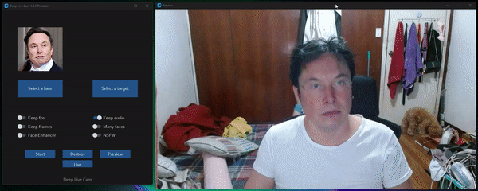
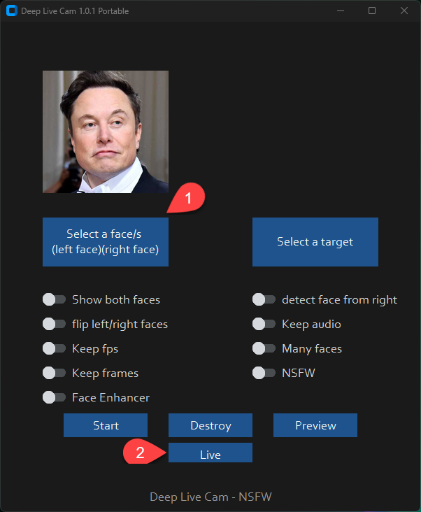

## Disclaimer
This software is meant to be a productive contribution to the rapidly growing AI-generated media industry. It will help artists with tasks such as animating a custom character or using the character as a model for clothing etc.

The developers of this software are aware of its possible unethical applications and are committed to take preventative measures against them. It has a built-in check which prevents the program from working on inappropriate media including but not limited to nudity, graphic content, sensitive material such as war footage etc. We will continue to develop this project in the positive direction while adhering to law and ethics. This project may be shut down or include watermarks on the output if requested by law.

Users of this software are expected to use this software responsibly while abiding by local laws. If the face of a real person is being used, users are required to get consent from the concerned person and clearly mention that it is a deepfake when posting content online. Developers of this software will not be responsible for actions of end-users.

## How do I install it?


### Basic: It is more likely to work on your computer but it will also be very slow. You can follow instructions for the basic install (This usually runs via **CPU**)
#### 1.Setup your platform
-   python (3.10 recommended)
-   pip
-   git
-   [ffmpeg](https://www.youtube.com/watch?v=OlNWCpFdVMA) 
-   [visual studio 2022 runtimes (windows)](https://visualstudio.microsoft.com/visual-cpp-build-tools/)
#### 2. Clone Repository
    https://github.com/hacksider/Deep-Live-Cam.git

#### 3. Download Models

 1. [GFPGANv1.4](https://huggingface.co/hacksider/deep-live-cam/resolve/main/GFPGANv1.4.pth)
 2. [inswapper_128_fp16.onnx](https://huggingface.co/hacksider/deep-live-cam/resolve/main/inswapper_128_fp16.onnx)

Then put those 2 files on the "**models**" folder

#### 4. Install dependency
We highly recommend to work with a  `venv`  to avoid issues.
```
pip install -r requirements.txt
```
##### DONE!!! If you dont have any GPU, You should be able to run roop using `python run.py` command. Keep in mind that while running the program for first time, it will download some models which can take time depending on your network connection.

### *Proceed if you want to use GPU Acceleration
### CUDA Execution Provider (Nvidia)*

1.  Install  [CUDA Toolkit 11.8](https://developer.nvidia.com/cuda-11-8-0-download-archive)
    
2.  Install dependencies:
    

```
pip uninstall onnxruntime onnxruntime-gpu
pip install onnxruntime-gpu==1.16.3

```

3.  Usage in case the provider is available:

```
python run.py --execution-provider cuda

```

### [](https://github.com/s0md3v/roop/wiki/2.-Acceleration#coreml-execution-provider-apple-silicon)CoreML Execution Provider (Apple Silicon)

1.  Install dependencies:

```
pip uninstall onnxruntime onnxruntime-silicon
pip install onnxruntime-silicon==1.13.1

```

2.  Usage in case the provider is available:

```
python run.py --execution-provider coreml

```

### [](https://github.com/s0md3v/roop/wiki/2.-Acceleration#coreml-execution-provider-apple-legacy)CoreML Execution Provider (Apple Legacy)

1.  Install dependencies:

```
pip uninstall onnxruntime onnxruntime-coreml
pip install onnxruntime-coreml==1.13.1

```

2.  Usage in case the provider is available:

```
python run.py --execution-provider coreml

```

### [](https://github.com/s0md3v/roop/wiki/2.-Acceleration#directml-execution-provider-windows)DirectML Execution Provider (Windows)

1.  Install dependencies:

```
pip uninstall onnxruntime onnxruntime-directml
pip install onnxruntime-directml==1.15.1

```

2.  Usage in case the provider is available:

```
python run.py --execution-provider directml

```

### [](https://github.com/s0md3v/roop/wiki/2.-Acceleration#openvino-execution-provider-intel)OpenVINO™ Execution Provider (Intel)

1.  Install dependencies:

```
pip uninstall onnxruntime onnxruntime-openvino
pip install onnxruntime-openvino==1.15.0

```

2.  Usage in case the provider is available:

```
python run.py --execution-provider openvino
```

## How do I use it?
> Note: When you run this program for the first time, it will download some models ~300MB in size.

Executing `python run.py` command will launch this window:


Choose a face (image with desired face) and the target image/video (image/video in which you want to replace the face) and click on `Start`. Open file explorer and navigate to the directory you select your output to be in. You will find a directory named `<video_title>` where you can see the frames being swapped in realtime. Once the processing is done, it will create the output file. That's it.

## For the webcam mode
Just follow the clicks on the screenshot
1. Select a face
2. Click live
3. Wait for a few seconds (it takes a longer time, usually 10 to 30 seconds before the preview shows up)


Just use your favorite screencapture to stream like OBS
> Note: In case you want to change your face, just select another picture, the preview mode will then restart (so just wait a bit).


Additional command line arguments are given below. To learn out what they do, check [this guide](https://github.com/s0md3v/roop/wiki/Advanced-Options).

```
options:
  -h, --help                                               show this help message and exit
  -s SOURCE_PATH, --source SOURCE_PATH                     select an source image
  -t TARGET_PATH, --target TARGET_PATH                     select an target image or video
  -o OUTPUT_PATH, --output OUTPUT_PATH                     select output file or directory
  --frame-processor FRAME_PROCESSOR [FRAME_PROCESSOR ...]  frame processors (choices: face_swapper, face_enhancer, ...)
  --keep-fps                                               keep original fps
  --keep-audio                                             keep original audio
  --keep-frames                                            keep temporary frames
  --many-faces                                             process every face
  --video-encoder {libx264,libx265,libvpx-vp9}             adjust output video encoder
  --video-quality [0-51]                                   adjust output video quality
  --max-memory MAX_MEMORY                                  maximum amount of RAM in GB
  --execution-provider {cpu} [{cpu} ...]                   available execution provider (choices: cpu, ...)
  --execution-threads EXECUTION_THREADS                    number of execution threads
  -v, --version                                            show program's version number and exit
```

Looking for a CLI mode? Using the -s/--source argument will make the run program in cli mode.

## Want the Next Update Now?
If you want the latest and greatest build, or want to see some new great features, go to our [experimental branch](https://github.com/hacksider/Deep-Live-Cam/tree/experimental) and experience what the contributors have given.

## Credits

- [ffmpeg](https://ffmpeg.org/): for making video related operations easy
- [deepinsight](https://github.com/deepinsight): for their [insightface](https://github.com/deepinsight/insightface) project which provided a well-made library and models.
- [havok2-htwo](https://github.com/havok2-htwo) : for sharing the code for webcam
- [GosuDRM](https://github.com/GosuDRM/nsfw-roop) : for uncensoring roop
- and [all developers](https://github.com/hacksider/Deep-Live-Cam/graphs/contributors) behind libraries used in this project.
- Foot Note: [This is originally roop-cam, see the full history of the code here.](https://github.com/hacksider/roop-cam) Please be informed that the base author of the code is [s0md3v](https://github.com/s0md3v/roop)
