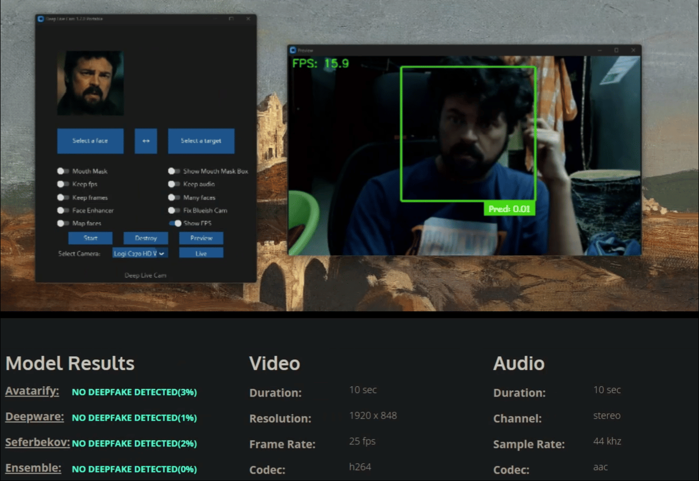

<h1 align="center">Deep-Live-Cam</h1>

<p align="center">
  Real-time face swap and video deepfake with a single click and only a single image.
</p>

<p align="center">
<a href="https://trendshift.io/repositories/11395" target="_blank"></a>
</p>

<p align="center">
  
  
</p>


## Disclaimer

This software is intended as a productive contribution to the AI-generated media industry. It aims to assist artists with tasks like animating custom characters or using them as models for clothing, etc.

We are aware of the potential for unethical applications and are committed to preventative measures. A built-in check prevents the program from processing inappropriate media (nudity, graphic content, sensitive material like war footage, etc.). We will continue to develop this project responsibly, adhering to law and ethics. We may shut down the project or add watermarks if legally required.

Users are expected to use this software responsibly and legally. If using a real person's face, obtain their consent and clearly label any output as a deepfake when sharing online. We are not responsible for end-user actions.


## Quick Start (Windows / Nvidia)

[](https://hacksider.gumroad.com/l/vccdmm) 

[Download latest pre-built version with CUDA support](https://hacksider.gumroad.com/l/vccdmm) - No Manual Installation/Downloading required and Early features testing.

## Installation (Manual)
**Please be aware that the installation needs technical skills and is not for beginners, consider downloading the prebuilt.**

<details>
<summary>Click to see the process</summary>

### Installation

This is more likely to work on your computer but will be slower as it utilizes the CPU.

**1. Setup Your Platform**

- Python (3.10 recommended)
- pip
- git
- [ffmpeg](https://www.youtube.com/watch?v=OlNWCpFdVMA) 
- [Visual Studio 2022 Runtimes (Windows)](https://visualstudio.microsoft.com/visual-cpp-build-tools/)

**2. Clone Repository**

```bash
https://github.com/hacksider/Deep-Live-Cam.git
```

**3. Download Models**

1. [GFPGANv1.4](https://huggingface.co/hacksider/deep-live-cam/resolve/main/GFPGANv1.4.pth)
2. [inswapper_128_fp16.onnx](https://huggingface.co/hacksider/deep-live-cam/resolve/main/inswapper_128.onnx) (Note: Use this [replacement version](https://github.com/facefusion/facefusion-assets/releases/download/models/inswapper_128.onnx) if you encounter issues)

Place these files in the "**models**" folder.

**4. Install Dependencies**

We highly recommend using a `venv` to avoid issues.

```bash
pip install -r requirements.txt
```

**For macOS:** Install or upgrade the `python-tk` package:

```bash
brew install python-tk@3.10
```

**Run:** If you don't have a GPU, you can run Deep-Live-Cam using `python run.py`. Note that initial execution will download models (~300MB).


### GPU Acceleration 

**CUDA Execution Provider (Nvidia)**

1. Install [CUDA Toolkit 11.8](https://developer.nvidia.com/cuda-11-8-0-download-archive)
2. Install dependencies:
```bash
pip uninstall onnxruntime onnxruntime-gpu
pip install onnxruntime-gpu==1.16.3
```
3. Usage:
```bash
python run.py --execution-provider cuda
```

**CoreML Execution Provider (Apple Silicon)**

1. Install dependencies:
```bash
pip uninstall onnxruntime onnxruntime-silicon
pip install onnxruntime-silicon==1.13.1
```
2. Usage:
```bash
python run.py --execution-provider coreml
```

**CoreML Execution Provider (Apple Legacy)**

1. Install dependencies:
```bash
pip uninstall onnxruntime onnxruntime-coreml
pip install onnxruntime-coreml==1.13.1
```
2. Usage:
```bash
python run.py --execution-provider coreml
```

**DirectML Execution Provider (Windows)**

1. Install dependencies:
```bash
pip uninstall onnxruntime onnxruntime-directml
pip install onnxruntime-directml==1.15.1
```
2. Usage:
```bash
python run.py --execution-provider directml
```

**OpenVINO™ Execution Provider (Intel)**

1. Install dependencies:
```bash
pip uninstall onnxruntime onnxruntime-openvino
pip install onnxruntime-openvino==1.15.0
```
2. Usage:
```bash
python run.py --execution-provider openvino
```

</details>


## Usage

**1. Image/Video Mode**

- Execute `python run.py`. 
- Choose a source face image and a target image/video.
- Click "Start".
- The output will be saved in a directory named after the target video.

**2. Webcam Mode**

- Execute `python run.py`.
- Select a source face image.
- Click "Live".
- Wait for the preview to appear (10-30 seconds).
- Use a screen capture tool like OBS to stream.
- To change the face, select a new source image.

## Features - Everything is realtime

### Mouth Mask

**Retain your original mouth using Mouth Mask** 


### Face Mapping

**Use different faces on multiple subjects**


### Your Movie, Your Face

**Watch movies with any face in realtime**


## Benchmarks

**Nearly 0% detection!**



## Command Line Arguments (Unmaintained)

```
options:
  -h, --help                                               show this help message and exit
  -s SOURCE_PATH, --source SOURCE_PATH                     select a source image
  -t TARGET_PATH, --target TARGET_PATH                     select a target image or video
  -o OUTPUT_PATH, --output OUTPUT_PATH                     select output file or directory
  --frame-processor FRAME_PROCESSOR [FRAME_PROCESSOR ...]  frame processors (choices: face_swapper, face_enhancer, ...)
  --keep-fps                                               keep original fps
  --keep-audio                                             keep original audio
  --keep-frames                                            keep temporary frames
  --many-faces                                             process every face
  --map-faces                                              map source target faces
  --mouth-mask                                             mask the mouth region
  --nsfw-filter                                            filter the NSFW image or video
  --video-encoder {libx264,libx265,libvpx-vp9}             adjust output video encoder
  --video-quality [0-51]                                   adjust output video quality
  --live-mirror                                            the live camera display as you see it in the front-facing camera frame
  --live-resizable                                         the live camera frame is resizable
  --max-memory MAX_MEMORY                                  maximum amount of RAM in GB
  --execution-provider {cpu} [{cpu} ...]                   available execution provider (choices: cpu, ...)
  --execution-threads EXECUTION_THREADS                    number of execution threads
  -v, --version                                            show program's version number and exit
```

Looking for a CLI mode? Using the -s/--source argument will make the run program in cli mode.


## Press
 **We are always open to criticism and ready to improve, that's why we didn't cherrypick anything.** 

 - [*"Deep-Live-Cam goes viral, allowing anyone to become a digital doppelganger"*](https://arstechnica.com/information-technology/2024/08/new-ai-tool-enables-real-time-face-swapping-on-webcams-raising-fraud-concerns/) - Ars Technica
 - [*"Thanks Deep Live Cam, shapeshifters are among us now"*](https://dataconomy.com/2024/08/15/what-is-deep-live-cam-github-deepfake/) - Dataconomy
 - [*"This free AI tool lets you become anyone during video-calls"*](https://www.newsbytesapp.com/news/science/deep-live-cam-ai-impersonation-tool-goes-viral/story) - NewsBytes
 - [*"OK, this viral AI live stream software is truly terrifying"*](https://www.creativebloq.com/ai/ok-this-viral-ai-live-stream-software-is-truly-terrifying) - Creative Bloq
 - [*"Deepfake AI Tool Lets You Become Anyone in a Video Call With Single Photo"*](https://petapixel.com/2024/08/14/deep-live-cam-deepfake-ai-tool-lets-you-become-anyone-in-a-video-call-with-single-photo-mark-zuckerberg-jd-vance-elon-musk/) - PetaPixel
 - [*"Deep-Live-Cam Uses AI to Transform Your Face in Real-Time, Celebrities Included"*](https://www.techeblog.com/deep-live-cam-ai-transform-face/) - TechEBlog
 - [*"An AI tool that "makes you look like anyone" during a video call is going viral online"*](https://telegrafi.com/en/a-tool-that-makes-you-look-like-anyone-during-a-video-call-is-going-viral-on-the-Internet/) - Telegrafi
 - [*"This Deepfake Tool Turning Images Into Livestreams is Topping the GitHub Charts"*](https://decrypt.co/244565/this-deepfake-tool-turning-images-into-livestreams-is-topping-the-github-charts) - Emerge
 - [*"New Real-Time Face-Swapping AI Allows Anyone to Mimic Famous Faces"*](https://www.digitalmusicnews.com/2024/08/15/face-swapping-ai-real-time-mimic/) - Digital Music News
 - [*"This real-time webcam deepfake tool raises alarms about the future of identity theft"*](https://www.diyphotography.net/this-real-time-webcam-deepfake-tool-raises-alarms-about-the-future-of-identity-theft/) - DIYPhotography
 - [*"That's Crazy, Oh God. That's Fucking Freaky Dude... That's So Wild Dude"*](https://www.youtube.com/watch?time_continue=1074&v=py4Tc-Y8BcY) - SomeOrdinaryGamers
 - [*"Alright look look look, now look chat, we can do any face we want to look like chat"*](https://www.youtube.com/live/mFsCe7AIxq8?feature=shared&t=2686) - IShowSpeed
 

## Credits

- [ffmpeg](https://ffmpeg.org/): for making video related operations easy
- [deepinsight](https://github.com/deepinsight): for their [insightface](https://github.com/deepinsight/insightface) project which provided a well-made library and models. Please be reminded that the [use of the model is for non-commercial research purposes only](https://github.com/deepinsight/insightface?tab=readme-ov-file#license).
- [havok2-htwo](https://github.com/havok2-htwo) : for sharing the code for webcam
- [GosuDRM](https://github.com/GosuDRM) : for open version of roop
- [pereiraroland26](https://github.com/pereiraroland26) : Multiple faces support
- [vic4key](https://github.com/vic4key) : For supporting/contributing on this project
- [KRSHH](https://github.com/KRSHH) : For his contributions
- and [all developers](https://github.com/hacksider/Deep-Live-Cam/graphs/contributors) behind libraries used in this project.
- Foot Note: Please be informed that the base author of the code is [s0md3v](https://github.com/s0md3v/roop)
- All the wonderful users who helped making this project go viral by starring the repo ❤️

[](https://github.com/hacksider/Deep-Live-Cam/stargazers)

## Contributions

## Stars to the Moon 🚀

<a href="https://star-history.com/#hacksider/deep-live-cam&Date">
 <picture>
   <source media="(prefers-color-scheme: dark)" srcset="https://api.star-history.com/svg?repos=hacksider/deep-live-cam&type=Date&theme=dark" />
   <source media="(prefers-color-scheme: light)" srcset="https://api.star-history.com/svg?repos=hacksider/deep-live-cam&type=Date" />
   
 </picture>
</a>
