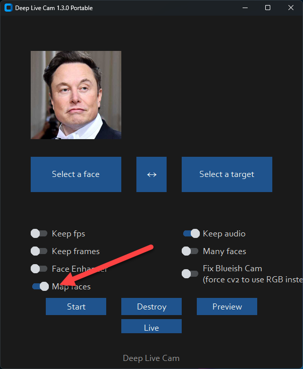
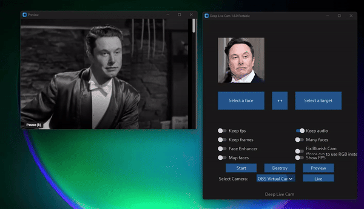
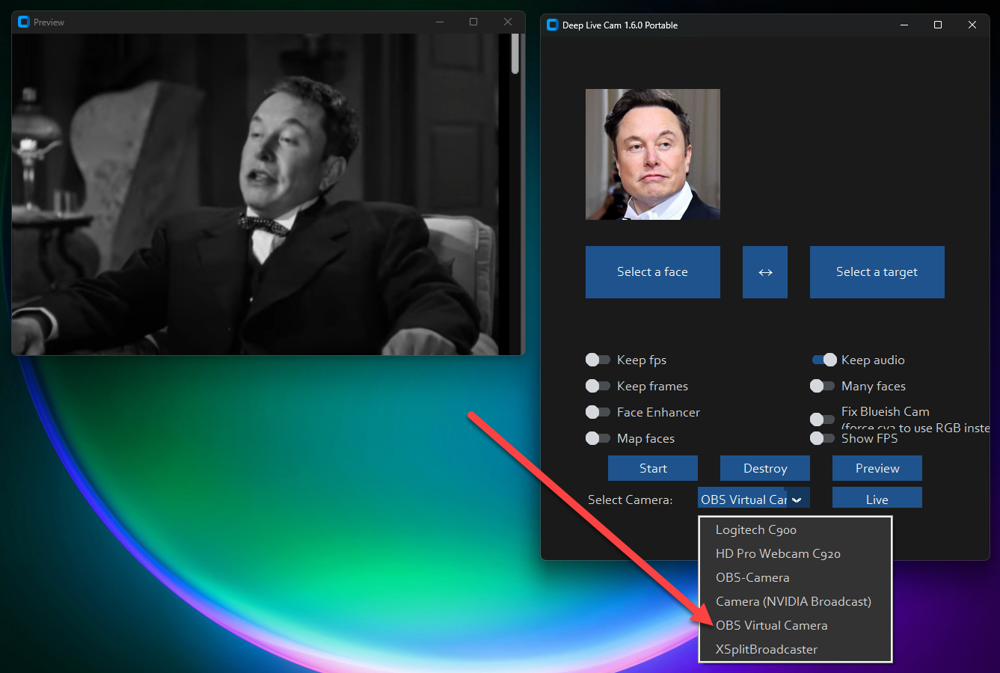

<h1 align="center">Deep-Live-Cam</h1>

<p align="center">
  Real-time face swap and video deepfake with a single click and only a single image.
</p>

<p align="center">
  
  
</p>

## Disclaimer

This software is intended as a productive contribution to the AI-generated media industry. It aims to assist artists with tasks like animating custom characters or using them as models for clothing, etc.

We are aware of the potential for unethical applications and are committed to preventative measures. A built-in check prevents the program from processing inappropriate media (nudity, graphic content, sensitive material like war footage, etc.). We will continue to develop this project responsibly, adhering to law and ethics. We may shut down the project or add watermarks if legally required.

Users are expected to use this software responsibly and legally. If using a real person's face, obtain their consent and clearly label any output as a deepfake when sharing online. We are not responsible for end-user actions.


## Quick Start (Windows / Nvidia)

[](https://hacksider.gumroad.com/l/vccdmm) 

[Download latest pre-built version with CUDA support](https://hacksider.gumroad.com/l/vccdmm) - No Manual Installation/Downloading required.

## Installation (Manual)
**Please be aware that the installation needs technical skills and is NOT for beginners, consider downloading the prebuilt. Please do NOT open platform and installation related issues on GitHub before discussing it on the discord server.**
### Basic Installation (CPU)

This is more likely to work on your computer but will be slower as it utilizes the CPU.

**1. Setup Your Platform**

- Python (3.10 recommended)
- pip
- git
- [ffmpeg](https://www.youtube.com/watch?v=OlNWCpFdVMA) 
- [Visual Studio 2022 Runtimes (Windows)](https://visualstudio.microsoft.com/visual-cpp-build-tools/)

**2. Clone Repository**

```bash
https://github.com/hacksider/Deep-Live-Cam.git
```

**3. Download Models**

1. [GFPGANv1.4](https://huggingface.co/hacksider/deep-live-cam/resolve/main/GFPGANv1.4.pth)
2. [inswapper_128_fp16.onnx](https://huggingface.co/hacksider/deep-live-cam/resolve/main/inswapper_128.onnx) (Note: Use this [replacement version](https://github.com/facefusion/facefusion-assets/releases/download/models/inswapper_128.onnx) if you encounter issues)

Place these files in the "**models**" folder.

**4. Install Dependencies**

We highly recommend using a `venv` to avoid issues.

```bash
pip install -r requirements.txt
```

**For macOS:** Install or upgrade the `python-tk` package:

```bash
brew install python-tk@3.10
```

**Run:** If you don't have a GPU, you can run Deep-Live-Cam using `python run.py`. Note that initial execution will download models (~300MB).


### GPU Acceleration (Optional)

<details>
<summary>Click to see the details</summary>

**CUDA Execution Provider (Nvidia)**

1. Install [CUDA Toolkit 11.8](https://developer.nvidia.com/cuda-11-8-0-download-archive)
2. Install dependencies:
```bash
pip uninstall onnxruntime onnxruntime-gpu
pip install onnxruntime-gpu==1.16.3
```
3. Usage:
```bash
python run.py --execution-provider cuda
```

**CoreML Execution Provider (Apple Silicon)**

1. Install dependencies:
```bash
pip uninstall onnxruntime onnxruntime-silicon
pip install onnxruntime-silicon==1.13.1
```
2. Usage:
```bash
python run.py --execution-provider coreml
```

**CoreML Execution Provider (Apple Legacy)**

1. Install dependencies:
```bash
pip uninstall onnxruntime onnxruntime-coreml
pip install onnxruntime-coreml==1.13.1
```
2. Usage:
```bash
python run.py --execution-provider coreml
```

**DirectML Execution Provider (Windows)**

1. Install dependencies:
```bash
pip uninstall onnxruntime onnxruntime-directml
pip install onnxruntime-directml==1.15.1
```
2. Usage:
```bash
python run.py --execution-provider directml
```

**OpenVINO™ Execution Provider (Intel)**

1. Install dependencies:
```bash
pip uninstall onnxruntime onnxruntime-openvino
pip install onnxruntime-openvino==1.15.0
```
2. Usage:
```bash
python run.py --execution-provider openvino
```

</details>


## Usage

**1. Image/Video Mode**

- Execute `python run.py`. 
- Choose a source face image and a target image/video.
- Click "Start".
- The output will be saved in a directory named after the target video.

**2. Webcam Mode**

- Execute `python run.py`.
- Select a source face image.
- Click "Live".
- Wait for the preview to appear (10-30 seconds).
- Use a screen capture tool like OBS to stream.
- To change the face, select a new source image.


## Features

### Resizable Preview Window

Dynamically improve performance using the `--live-resizable` parameter.


### Face Mapping

Track and change faces on the fly.


**Source Video:**



**Enable Face Mapping:**


**Map the Faces:**


**See the Magic!**



**Watch movies in realtime:**

It's as simple as opening a movie on the screen, and selecting OBS as your camera!



## Command Line Arguments

```
options:
  -h, --help                                               show this help message and exit
  -s SOURCE_PATH, --source SOURCE_PATH                     select a source image
  -t TARGET_PATH, --target TARGET_PATH                     select a target image or video
  -o OUTPUT_PATH, --output OUTPUT_PATH                     select output file or directory
  --frame-processor FRAME_PROCESSOR [FRAME_PROCESSOR ...]  frame processors (choices: face_swapper, face_enhancer, ...)
  --keep-fps                                               keep original fps
  --keep-audio                                             keep original audio
  --keep-frames                                            keep temporary frames
  --many-faces                                             process every face
  --map-faces                                              map source target faces
  --nsfw-filter                                            filter the NSFW image or video
  --video-encoder {libx264,libx265,libvpx-vp9}             adjust output video encoder
  --video-quality [0-51]                                   adjust output video quality
  --live-mirror                                            the live camera display as you see it in the front-facing camera frame
  --live-resizable                                         the live camera frame is resizable
  --max-memory MAX_MEMORY                                  maximum amount of RAM in GB
  --execution-provider {cpu} [{cpu} ...]                   available execution provider (choices: cpu, ...)
  --execution-threads EXECUTION_THREADS                    number of execution threads
  -v, --version                                            show program's version number and exit
```

Looking for a CLI mode? Using the -s/--source argument will make the run program in cli mode.


## Webcam Mode on WSL2 Ubuntu (Optional)

<details>
<summary>Click to see the details</summary>

If you want to use WSL2 on Windows 11 you will notice, that Ubuntu WSL2 doesn't come with USB-Webcam support in the Kernel. You need to do two things: Compile the Kernel with the right modules integrated and forward your USB Webcam from Windows to Ubuntu with the usbipd app. Here are detailed Steps:

This tutorial will guide you through the process of setting up WSL2 Ubuntu with USB webcam support, rebuilding the kernel, and preparing the environment for the Deep-Live-Cam project.  
  
**1. Install WSL2 Ubuntu**  
  
Install WSL2 Ubuntu from the Microsoft Store or using PowerShell:  
  
**2. Enable USB Support in WSL2**  
  
1. Install the USB/IP tool for Windows:  
[https://learn.microsoft.com/en-us/windows/wsl/connect-usb](https://learn.microsoft.com/en-us/windows/wsl/connect-usb)  
  
2. In Windows PowerShell (as Administrator), connect your webcam to WSL:  
  
```powershell  
usbipd list  
usbipd bind --busid x-x # Replace x-x with your webcam's bus ID  
usbipd attach --wsl --busid x-x # Replace x-x with your webcam's bus ID  
```  
 You need to redo the above every time you reboot wsl or re-connect your webcam/usb device.
 
**3. Rebuild WSL2 Ubuntu Kernel with USB and Webcam Modules**  
  
Follow these steps to rebuild the kernel:  
  
1. Start with this guide: [https://github.com/PINTO0309/wsl2_linux_kernel_usbcam_enable_conf](https://github.com/PINTO0309/wsl2_linux_kernel_usbcam_enable_conf)  
  
2. When you reach the `sudo wget [github.com](http://github.com/)...PINTO0309` step, which won't work for newer kernel versions, follow this video instead or alternatively follow the video tutorial from the beginning: 
[https://www.youtube.com/watch?v=t_YnACEPmrM](https://www.youtube.com/watch?v=t_YnACEPmrM)  
  
Additional info: [https://askubuntu.com/questions/1413377/camera-not-working-in-cheese-in-wsl2](https://askubuntu.com/questions/1413377/camera-not-working-in-cheese-in-wsl2)  
  
3. After rebuilding, restart WSL with the new kernel. 
  
**4. Set Up Deep-Live-Cam Project**  
 Within Ubuntu:
1. Clone the repository:  
  
```bash  
git clone [https://github.com/hacksider/Deep-Live-Cam](https://github.com/hacksider/Deep-Live-Cam)  
```  
  
2. Follow the installation instructions in the repository, including cuda toolkit 11.8, make 100% sure it's not cuda toolkit 12.x.  
   
**5. Verify and Load Kernel Modules**  
  
1. Check if USB and webcam modules are built into the kernel:  
  
```bash  
zcat /proc/config.gz | grep -i "CONFIG_USB_VIDEO_CLASS"  
```  
  
2. If modules are loadable (m), not built-in (y), check if the file exists:  
  
```bash  
ls /lib/modules/$(uname -r)/kernel/drivers/media/usb/uvc/  
```  
  
3. Load the module and check for errors (optional if built-in):  
  
```bash  
sudo modprobe uvcvideo  
dmesg | tail  
```  
  
4. Verify video devices:  
  
```bash  
sudo ls -al /dev/video*  
```  
  
**6. Set Up Permissions**  
  
1. Add user to video group and set permissions:  
  
```bash  
sudo usermod -a -G video $USER  
sudo chgrp video /dev/video0 /dev/video1  
sudo chmod 660 /dev/video0 /dev/video1  
```  
  
2. Create a udev rule for permanent permissions:  
  
```bash  
sudo nano /etc/udev/rules.d/81-webcam.rules  
```  
  
Add this content:  
  
```  
KERNEL=="video[0-9]*", GROUP="video", MODE="0660"  
```  
  
3. Reload udev rules:  
  
```bash  
sudo udevadm control --reload-rules && sudo udevadm trigger  
```  
  
4. Log out and log back into your WSL session.  
  
5. Start Deep-Live-Cam with `python run.py --execution-provider cuda --max-memory 8` where 8 can be changed to the number of GB VRAM of your GPU has, minus 1-2GB. If you have a RTX3080 with 10GB I suggest adding 8GB. Leave some left for Windows.

**Final Notes**  
  
- Steps 6 and 7 may be optional if the modules are built into the kernel and permissions are already set correctly.  
- Always ensure you're using compatible versions of CUDA, ONNX, and other dependencies.  
- If issues persist, consider checking the Deep-Live-Cam project's specific requirements and troubleshooting steps.  
  
By following these steps, you should have a WSL2 Ubuntu environment with USB webcam support ready for the Deep-Live-Cam project. If you encounter any issues, refer back to the specific error messages and troubleshooting steps provided.

**Troubleshooting CUDA Issues** 

If you encounter this error:  
  
```  
[ONNXRuntimeError] : 1 : FAIL : Failed to load library [libonnxruntime_providers_cuda.so](http://libonnxruntime_providers_cuda.so/) with error: libcufft.so.10: cannot open shared object file: No such file or directory  
```  
  
Follow these steps:  
  
1. Install CUDA Toolkit 11.8 (ONNX 1.16.3 requires CUDA 11.x, not 12.x):  
[https://developer.nvidia.com/cuda-11-8-0-download-archive](https://developer.nvidia.com/cuda-11-8-0-download-archive)  
  select: Linux, x86_64, WSL-Ubuntu, 2.0, deb (local)
2. Check CUDA version:  
  
```bash  
/usr/local/cuda/bin/nvcc --version  
```  
  
3. If the wrong version is installed, remove it completely:  
[https://askubuntu.com/questions/530043/removing-nvidia-cuda-toolkit-and-installing-new-one](https://askubuntu.com/questions/530043/removing-nvidia-cuda-toolkit-and-installing-new-one)  
  
4. Install CUDA Toolkit 11.8 again [https://developer.nvidia.com/cuda-11-8-0-download-archive](https://developer.nvidia.com/cuda-11-8-0-download-archive), select: Linux, x86_64, WSL-Ubuntu, 2.0, deb (local)
  
```bash  
sudo apt-get -y install cuda-toolkit-11-8  
```
</details>


## Future Updates & Roadmap

For the latest experimental builds and features, see the [experimental branch](https://github.com/hacksider/Deep-Live-Cam/tree/experimental).

**TODO:**

- [ ] Develop a version for web app/service
- [ ] Speed up model loading
- [ ] Speed up real-time face swapping
- [x] Support multiple faces 
- [x] UI/UX enhancements for desktop app

This is an open-source project developed in our free time. Updates may be delayed.

**Tips and Links:**
- [How to make the most of Deep-Live-Cam](https://hacksider.gumroad.com/p/how-to-make-the-most-on-deep-live-cam)
- Face enhancer is good, but still very slow for any live streaming purpose.


## Credits

- [ffmpeg](https://ffmpeg.org/): for making video related operations easy
- [deepinsight](https://github.com/deepinsight): for their [insightface](https://github.com/deepinsight/insightface) project which provided a well-made library and models. Please be reminded that the [use of the model is for non-commercial research purposes only](https://github.com/deepinsight/insightface?tab=readme-ov-file#license).
- [havok2-htwo](https://github.com/havok2-htwo) : for sharing the code for webcam
- [GosuDRM](https://github.com/GosuDRM) : for open version of roop
- [pereiraroland26](https://github.com/pereiraroland26) : Multiple faces support
- [vic4key](https://github.com/vic4key) : For supporting/contributing on this project
- [KRSHH](https://github.com/KRSHH) : For his contributions
- and [all developers](https://github.com/hacksider/Deep-Live-Cam/graphs/contributors) behind libraries used in this project.
- Foot Note: [This is originally roop-cam, see the full history of the code here.](https://github.com/hacksider/roop-cam) Please be informed that the base author of the code is [s0md3v](https://github.com/s0md3v/roop)

## Contributions

## Star History

<a href="https://star-history.com/#hacksider/deep-live-cam&Date">
 <picture>
   <source media="(prefers-color-scheme: dark)" srcset="https://api.star-history.com/svg?repos=hacksider/deep-live-cam&type=Date&theme=dark" />
   <source media="(prefers-color-scheme: light)" srcset="https://api.star-history.com/svg?repos=hacksider/deep-live-cam&type=Date" />
   
 </picture>
</a>
