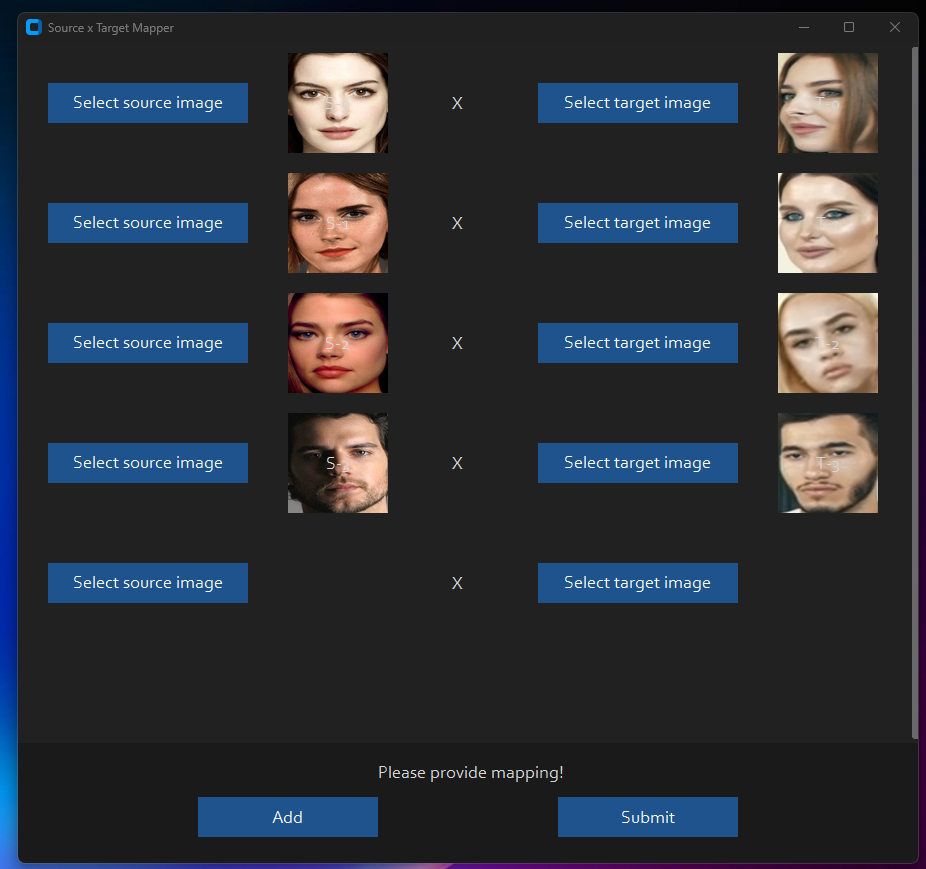

## Disclaimer
This software is meant to be a productive contribution to the rapidly growing AI-generated media industry. It will help artists with tasks such as animating a custom character or using the character as a model for clothing etc.

The developers of this software are aware of its possible unethical applications and are committed to take preventative measures against them. It has a built-in check which prevents the program from working on inappropriate media including but not limited to nudity, graphic content, sensitive material such as war footage etc. We will continue to develop this project in the positive direction while adhering to law and ethics. This project may be shut down or include watermarks on the output if requested by law.

Users of this software are expected to use this software responsibly while abiding by local laws. If the face of a real person is being used, users are required to get consent from the concerned person and clearly mention that it is a deepfake when posting content online. Developers of this software will not be responsible for actions of end-users.

## New Features
### Resizable Preview Window

Dynamically improve the performance by using the --resizable parameter


### Face Mapping

Track faces and change it on the fly


source video


Tick this switch



Map the faces


And see the magic!


## Want to skip the installation and just run it?
<details>
Here's the link without the tedious installation script below

[Windows / Nvidia](https://1689241962432.gumroad.com/l/vccdmm) CUDA still required
</details>

## How do I install it?


### Basic: It is more likely to work on your computer but it will also be very slow. You can follow instructions for the basic install (This usually runs via **CPU**)
#### 1.Setup your platform
-   python (3.10 recommended)
-   pip
-   git
-   [ffmpeg](https://www.youtube.com/watch?v=OlNWCpFdVMA) 
-   [visual studio 2022 runtimes (windows)](https://visualstudio.microsoft.com/visual-cpp-build-tools/)
#### 2. Clone Repository
    https://github.com/hacksider/Deep-Live-Cam.git

#### 3. Download Models

 1. [GFPGANv1.4](https://huggingface.co/hacksider/deep-live-cam/resolve/main/GFPGANv1.4.pth)
 2. [inswapper_128_fp16.onnx](https://huggingface.co/hacksider/deep-live-cam/resolve/main/inswapper_128_fp16.onnx) *(Note: Use this [replacement version](https://github.com/facefusion/facefusion-assets/releases/download/models/inswapper_128_fp16.onnx) if an issue occurs on your computer)*

Then put those 2 files on the "**models**" folder

#### 4. Install dependency
We highly recommend to work with a  `venv`  to avoid issues.
```
pip install -r requirements.txt
```
For MAC OS, You have to install or upgrade python-tk package:
```
brew install python-tk@3.10
```
##### DONE!!! If you don't have any GPU, You should be able to run Deep-Live-Cam using `python run.py` command. Keep in mind that while running the program for first time, it will download some models which can take time depending on your network connection.

#### 5. Proceed if you want to use GPU acceleration (optional)

<details>
<summary>Click to see the details</summary>

### CUDA Execution Provider (Nvidia)*

1.  Install  [CUDA Toolkit 11.8](https://developer.nvidia.com/cuda-11-8-0-download-archive)
2.  Install dependencies:
```
pip uninstall onnxruntime onnxruntime-gpu
pip install onnxruntime-gpu==1.16.3
```

3.  Usage in case the provider is available:
```
python run.py --execution-provider cuda
```

### [](https://github.com/s0md3v/roop/wiki/2.-Acceleration#coreml-execution-provider-apple-silicon)CoreML Execution Provider (Apple Silicon)

1.  Install dependencies:

```
pip uninstall onnxruntime onnxruntime-silicon
pip install onnxruntime-silicon==1.13.1
```

2.  Usage in case the provider is available:
```
python run.py --execution-provider coreml
```

### [](https://github.com/s0md3v/roop/wiki/2.-Acceleration#coreml-execution-provider-apple-legacy)CoreML Execution Provider (Apple Legacy)

1.  Install dependencies:
```
pip uninstall onnxruntime onnxruntime-coreml
pip install onnxruntime-coreml==1.13.1
```

2.  Usage in case the provider is available:
```
python run.py --execution-provider coreml
```

### [](https://github.com/s0md3v/roop/wiki/2.-Acceleration#directml-execution-provider-windows)DirectML Execution Provider (Windows)

1.  Install dependencies:
```
pip uninstall onnxruntime onnxruntime-directml
pip install onnxruntime-directml==1.15.1
```

2.  Usage in case the provider is available:
```
python run.py --execution-provider directml
```

### [](https://github.com/s0md3v/roop/wiki/2.-Acceleration#openvino-execution-provider-intel)OpenVINO™ Execution Provider (Intel)

1.  Install dependencies:
```
pip uninstall onnxruntime onnxruntime-openvino
pip install onnxruntime-openvino==1.15.0
```

2.  Usage in case the provider is available:
```
python run.py --execution-provider openvino
```
</details>

## How do I use it?
> Note: When you run this program for the first time, it will download some models ~300MB in size.

Executing `python run.py` command will launch this window:


Choose a face (image with desired face) and the target image/video (image/video in which you want to replace the face) and click on `Start`. Open file explorer and navigate to the directory you select your output to be in. You will find a directory named `<video_title>` where you can see the frames being swapped in realtime. Once the processing is done, it will create the output file. That's it.

## For the webcam mode
Just follow the clicks on the screenshot
1. Select a face
2. Click live
3. Wait for a few seconds (it takes a longer time, usually 10 to 30 seconds before the preview shows up)


Just use your favorite screencapture to stream like OBS
> Note: In case you want to change your face, just select another picture, the preview mode will then restart (so just wait a bit).


Additional command line arguments are given below. To learn out what they do, check [this guide](https://github.com/s0md3v/roop/wiki/Advanced-Options).

```
options:
  -h, --help                                               show this help message and exit
  -s SOURCE_PATH, --source SOURCE_PATH                     select a source image
  -t TARGET_PATH, --target TARGET_PATH                     select a target image or video
  -o OUTPUT_PATH, --output OUTPUT_PATH                     select output file or directory
  --frame-processor FRAME_PROCESSOR [FRAME_PROCESSOR ...]  frame processors (choices: face_swapper, face_enhancer, ...)
  --keep-fps                                               keep original fps
  --keep-audio                                             keep original audio
  --keep-frames                                            keep temporary frames
  --many-faces                                             process every face
  --map-faces                                              map source target faces
  --nsfw-filter                                            filter the NSFW image or video
  --video-encoder {libx264,libx265,libvpx-vp9}             adjust output video encoder
  --video-quality [0-51]                                   adjust output video quality
  --live-mirror                                            the live camera display as you see it in the front-facing camera frame
  --live-resizable                                         the live camera frame is resizable
  --max-memory MAX_MEMORY                                  maximum amount of RAM in GB
  --execution-provider {cpu} [{cpu} ...]                   available execution provider (choices: cpu, ...)
  --execution-threads EXECUTION_THREADS                    number of execution threads
  -v, --version                                            show program's version number and exit
```

Looking for a CLI mode? Using the -s/--source argument will make the run program in cli mode.

### Webcam mode on Windows 11 using WSL2 Ubuntu (optional)

<details>
<summary>Click to see the details</summary>

If you want to use WSL2 on Windows 11 you will notice, that Ubuntu WSL2 doesn't come with USB-Webcam support in the Kernel. You need to do two things: Compile the Kernel with the right modules integrated and forward your USB Webcam from Windows to Ubuntu with the usbipd app. Here are detailed Steps:

This tutorial will guide you through the process of setting up WSL2 Ubuntu with USB webcam support, rebuilding the kernel, and preparing the environment for the Deep-Live-Cam project.  
  
#### 1. Install WSL2 Ubuntu  
  
Install WSL2 Ubuntu from the Microsoft Store or using PowerShell:  
  
#### 2. Enable USB Support in WSL2  
  
1. Install the USB/IP tool for Windows:  
[https://learn.microsoft.com/en-us/windows/wsl/connect-usb](https://learn.microsoft.com/en-us/windows/wsl/connect-usb)  
  
2. In Windows PowerShell (as Administrator), connect your webcam to WSL:  
  
```powershell  
usbipd list  
usbipd bind --busid x-x # Replace x-x with your webcam's bus ID  
usbipd attach --wsl --busid x-x # Replace x-x with your webcam's bus ID  
```  
 You need to redo the above every time you reboot wsl or re-connect your webcam/usb device.
 
#### 3. Rebuild WSL2 Ubuntu Kernel with USB and Webcam Modules  
  
Follow these steps to rebuild the kernel:  
  
1. Start with this guide: [https://github.com/PINTO0309/wsl2_linux_kernel_usbcam_enable_conf](https://github.com/PINTO0309/wsl2_linux_kernel_usbcam_enable_conf)  
  
2. When you reach the `sudo wget [github.com](http://github.com/)...PINTO0309` step, which won't work for newer kernel versions, follow this video instead or alternatively follow the video tutorial from the beginning: 
[https://www.youtube.com/watch?v=t_YnACEPmrM](https://www.youtube.com/watch?v=t_YnACEPmrM)  
  
Additional info: [https://askubuntu.com/questions/1413377/camera-not-working-in-cheese-in-wsl2](https://askubuntu.com/questions/1413377/camera-not-working-in-cheese-in-wsl2)  
  
3. After rebuilding, restart WSL with the new kernel. 
  
#### 4. Set Up Deep-Live-Cam Project  
 Within Ubuntu:
1. Clone the repository:  
  
```bash  
git clone [https://github.com/hacksider/Deep-Live-Cam](https://github.com/hacksider/Deep-Live-Cam)  
```  
  
2. Follow the installation instructions in the repository, including cuda toolkit 11.8, make 100% sure it's not cuda toolkit 12.x.  
   
#### 5. Verify and Load Kernel Modules  
  
1. Check if USB and webcam modules are built into the kernel:  
  
```bash  
zcat /proc/config.gz | grep -i "CONFIG_USB_VIDEO_CLASS"  
```  
  
2. If modules are loadable (m), not built-in (y), check if the file exists:  
  
```bash  
ls /lib/modules/$(uname -r)/kernel/drivers/media/usb/uvc/  
```  
  
3. Load the module and check for errors (optional if built-in):  
  
```bash  
sudo modprobe uvcvideo  
dmesg | tail  
```  
  
4. Verify video devices:  
  
```bash  
sudo ls -al /dev/video*  
```  
  
#### 6. Set Up Permissions  
  
1. Add user to video group and set permissions:  
  
```bash  
sudo usermod -a -G video $USER  
sudo chgrp video /dev/video0 /dev/video1  
sudo chmod 660 /dev/video0 /dev/video1  
```  
  
2. Create a udev rule for permanent permissions:  
  
```bash  
sudo nano /etc/udev/rules.d/81-webcam.rules  
```  
  
Add this content:  
  
```  
KERNEL=="video[0-9]*", GROUP="video", MODE="0660"  
```  
  
3. Reload udev rules:  
  
```bash  
sudo udevadm control --reload-rules && sudo udevadm trigger  
```  
  
4. Log out and log back into your WSL session.  
  
5. Start Deep-Live-Cam with `python run.py --execution-provider cuda --max-memory 8` where 8 can be changed to the number of GB VRAM of your GPU has, minus 1-2GB. If you have a RTX3080 with 10GB I suggest adding 8GB. Leave some left for Windows.

#### Final Notes  
  
- Steps 6 and 7 may be optional if the modules are built into the kernel and permissions are already set correctly.  
- Always ensure you're using compatible versions of CUDA, ONNX, and other dependencies.  
- If issues persist, consider checking the Deep-Live-Cam project's specific requirements and troubleshooting steps.  
  
By following these steps, you should have a WSL2 Ubuntu environment with USB webcam support ready for the Deep-Live-Cam project. If you encounter any issues, refer back to the specific error messages and troubleshooting steps provided.

#### Troubleshooting CUDA Issues  

If you encounter this error:  
  
```  
[ONNXRuntimeError] : 1 : FAIL : Failed to load library [libonnxruntime_providers_cuda.so](http://libonnxruntime_providers_cuda.so/) with error: libcufft.so.10: cannot open shared object file: No such file or directory  
```  
  
Follow these steps:  
  
1. Install CUDA Toolkit 11.8 (ONNX 1.16.3 requires CUDA 11.x, not 12.x):  
[https://developer.nvidia.com/cuda-11-8-0-download-archive](https://developer.nvidia.com/cuda-11-8-0-download-archive)  
  select: Linux, x86_64, WSL-Ubuntu, 2.0, deb (local)
2. Check CUDA version:  
  
```bash  
/usr/local/cuda/bin/nvcc --version  
```  
  
3. If the wrong version is installed, remove it completely:  
[https://askubuntu.com/questions/530043/removing-nvidia-cuda-toolkit-and-installing-new-one](https://askubuntu.com/questions/530043/removing-nvidia-cuda-toolkit-and-installing-new-one)  
  
4. Install CUDA Toolkit 11.8 again [https://developer.nvidia.com/cuda-11-8-0-download-archive](https://developer.nvidia.com/cuda-11-8-0-download-archive), select: Linux, x86_64, WSL-Ubuntu, 2.0, deb (local)
  
```bash  
sudo apt-get -y install cuda-toolkit-11-8  
```
</details>

## Want the Next Update Now?
If you want the latest and greatest build, or want to see some new great features, go to our [experimental branch](https://github.com/hacksider/Deep-Live-Cam/tree/experimental) and experience what the contributors have given.

## TODO
:heavy_check_mark: Support multiple faces feature
- [ ] Develop a version for web app/service
- [ ] UI/UX enhancements for desktop app
- [ ] Speed up model loading
- [ ] Speed up real-time face swapping

*Note: This is an open-source project, and we’re working on it in our free time. Therefore, features, replies, bug fixes, etc., might be delayed. We hope you understand. Thanks.*

## Credits

- [ffmpeg](https://ffmpeg.org/): for making video related operations easy
- [deepinsight](https://github.com/deepinsight): for their [insightface](https://github.com/deepinsight/insightface) project which provided a well-made library and models. Please be reminded that the [use of the model is for non-commercial research purposes only](https://github.com/deepinsight/insightface?tab=readme-ov-file#license).
- [havok2-htwo](https://github.com/havok2-htwo) : for sharing the code for webcam
- [GosuDRM](https://github.com/GosuDRM/nsfw-roop) : for uncensoring roop
- [pereiraroland26](https://github.com/pereiraroland26) : Multiple faces support
- [vic4key](https://github.com/vic4key) : For supporting/contributing on this project
- and [all developers](https://github.com/hacksider/Deep-Live-Cam/graphs/contributors) behind libraries used in this project.
- Foot Note: [This is originally roop-cam, see the full history of the code here.](https://github.com/hacksider/roop-cam) Please be informed that the base author of the code is [s0md3v](https://github.com/s0md3v/roop)
